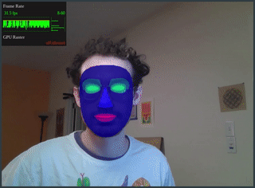

# Shaderbooth

Shaderbooth is a browser based editing environment for writing and sharing face filter artworks, based on fragment shaders and realtime facial landmark data.

Face detection uses TensorFlow.js [Facemesh](https://github.com/tensorflow/tfjs-models/tree/master/facemesh).

Inspired by:

Olivia Jack's [hydra](https://github.com/ojack/hydra)
Shawn Lawson's [The_Force](https://github.com/shawnlawson/The_Force)
Myron Krueger's [Videoplace](https://www.youtube.com/watch?v=dqZyZrN3Pl0)
Community of [Shadertoy](https://shadertoy.com)

and motivated by a frustration with walled gardens like those Spark AR instagram filters!

Todo:

localstorage persist (& reset button?)
revisit errors
codemirror typeahead
timeout to fade code away
view-mode for mobile

backend:
browse examples
upload function
hotlinkable

features:
provide glsl functions
background subtraction.
pass in more landmarks to shader.
GPU based paint.js?
custom textures, texture editor