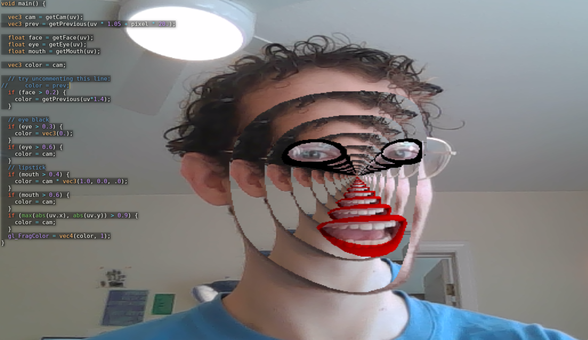

# Shaderbooth

Shaderbooth is a browser based framework and editing environment for makeing and sharing sharing indie face filter artworks, Try it out at (shaderbooth.com)[shaderbooth.com]

Framework API provides realtime facial landmark data to a single fragment shader.
Face detection uses TensorFlow.js [Facemesh](https://github.com/tensorflow/tfjs-models/tree/master/facemesh).

## Inspired by:

Olivia Jack's [hydra](https://github.com/ojack/hydra)

Shawn Lawson's [The_Force](https://github.com/shawnlawson/The_Force) (this tool is where I first learned to write shaders!)

Myron Krueger's [Videoplace](https://www.youtube.com/watch?v=dqZyZrN3Pl0)

Community of [Shadertoy](https://shadertoy.com)

macOS [Photo Booth](https://en.wikipedia.org/wiki/Photo_Booth)

It's also motivated by a frustration with owned creative ecosystems, like Spark AR instagram filters!

Todo:

- localstorage persist (& reset button?)
- revisit error
- codemirror typeahead (anyword-hint)
- 3x3

backend:

- upload function
- hotlinkable
- browse examples

features:

- background subtraction.
- pass in more landmarks to shader.
- GPU based paint.js?
- custom textures
- texture editor
